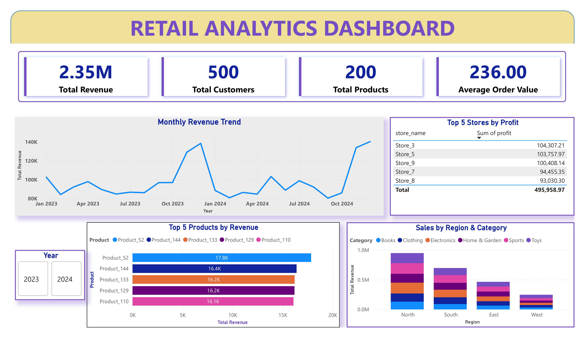
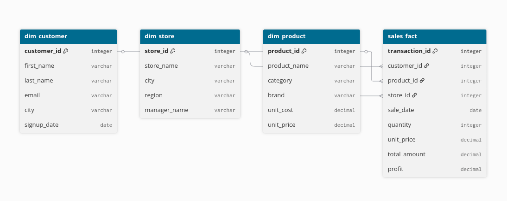

# Retail Analytics Dashboard: End-to-End SQL & ETL Project


## 🎯 Business Problem Statement
Retail executives lack real-time, granular visibility into performance drivers - making it difficult to optimize inventory, allocate marketing spend, and retain high-value customers. Without an integrated analytics pipeline that transforms raw transactional data into actionable insights, decisions are reactive, inefficient, and often based on incomplete information.

This project solves that gap by delivering an end-to-end analytics engine that:

- Tracks revenue trends and growth rates by region and product category
- Identifies top-performing stores and products to guide resource allocation
- Segments customers using RFM and cohort analysis to enable targeted retention
- Measures performance against operational targets (e.g., sales KPIs)
- The result: a data-driven foundation for proactive optimization - turning daily transactions into strategic advantage.

---
### From Python ETL → PostgreSQL → Advanced SQL → Power BI

This is an end-to-end analytics project demonstrating how raw transactional data can be transformed into actionable business insights using **PostgreSQL, Python ETL, advanced SQL, and Power BI**.  

This project combines **data engineering**, **analytical SQL**, and **business intelligence** principles to answer key questions about revenue, products, stores, and customer behavior.



---

## 🎯 Objective

- Design a **star schema** optimized for analytical queries.
- Build an **ETL pipeline** to transform raw data into a structured data warehouse.
- Implement **advanced SQL queries** using CTEs, window functions, and aggregations.
- Visualize key metrics in **Power BI** to enable strategic decision-making.

---

## 📁 Repository Structure
```
retail-analytics-sql/
├── data/ # Raw synthetic CSV files generated by ETL scripts
├── docs/ # ER diagram & Power BI dashboard screenshot
├── etl/ # Python scripts for data generation and loading
├── sql/ # SQL schema and business-focused queries
├── requirements.txt # Python dependencies
└── README.md # Project documentation
```
---

## 🗃 Database Schema

The project uses a **star schema** for OLAP queries:

- **Fact Table: `sales_fact`**
  - Metrics: `quantity`, `total_amount`, `profit`
  - Foreign keys: `customer_id`, `store_id`, `product_id`
- **Dimension Tables:**
  - `dim_customer`: Customer demographics and signup info
  - `dim_store`: Store details, region, and manager
  - `dim_product`: Product attributes, category, and pricing

The schema is defined in [`sql/schema.sql`](sql/schema.sql) and enables efficient analytical queries.



---

## ⚙️ ETL Pipeline

The ETL workflow is implemented in Python (`etl/generate_data.py` and `etl/load_data.py`):

1. **Extract:** Read raw CSV data from `data/`.  
2. **Transform:**  
   - Load dimension tables directly.  
   - Calculate `profit` per transaction:  
     ```sql
     profit = total_amount - (quantity * unit_cost)
     ```  
   - Prepare `sales_fact` data for loading.  
3. **Load:** Insert transformed data into PostgreSQL tables (`sales_fact` and dimension tables).  

---

## 🧠 Advanced SQL Queries

The `sql/queries.sql` file contains queries designed to answer real business questions:

### Key Analysis
1. **Sales Overview**
   - Monthly revenue, growth %, and running totals by region
   - Example:
     ```sql
     SELECT
         sale_month,
         SUM(total_amount) AS monthly_revenue,
         LAG(SUM(total_amount)) OVER (ORDER BY sale_month) AS prev_month_revenue
     FROM sales_fact
     GROUP BY sale_month;
     ```
2. **Product Analytics**
   - Top products by revenue, category rollups, store-level rankings
3. **Customer Analytics**
   - RFM segmentation: Recency, Frequency, Monetary value
   - Cohort retention: M0, M1, M2 analysis
4. **Store & Regional Performance**
   - Revenue trends, Average Order Value (AOV), and KPI vs target
5. **KPI & Dashboard Metrics**
   - Profit margins, growth %, ranking, and regional performance

**Techniques used:** CTEs, window functions (`LAG`, `RANK`, `NTILE`), `ROLLUP` for subtotals, and safe division (`NULLIF`) for production-ready queries.

---
## 📊 Key Metrics & Insights

- Top-selling products and most profitable stores
- Monthly and YoY revenue growth
- Customer segmentation and high-value cohorts
- Sales vs target KPIs by region
- Cohort retention trends for lifecycle management

---
## 🚀 Setup Instructions

### Prerequisites

- PostgreSQL server running locally  
- Python 3.8+  
- Required libraries: `pandas`, `sqlalchemy`, `psycopg2-binary`  
- Power BI Desktop (optional, for visualization)

### 1. Create Database
- CREATE DATABASE retail_analytics;

### 2. Install Python Dependencies
- pip install -r requirements.txt

### 3. Generate & Load Data
- cd etl
- python generate_data.py   # Creates CSVs in /data
- python load_data.py       # Loads data into PostgreSQL

### 4. Run Queries
- Use any PostgreSQL client (psql, pgAdmin, DBeaver) to execute queries in sql/queries.sql.

### 5. Visualize Metrics
- Open the Power BI dashboard (docs/powerbi_dashboard.png) to see visual insights.

## 📊 Insights & Use Cases

- Identify top-selling products and most profitable stores
- Track monthly revenue growth and regional performance
- Perform customer segmentation using RFM analysis
- Monitor sales vs target KPIs
- Understand cohort retention trends for customer lifecycle management

## 🛠 Technologies Used

- **Database:** PostgreSQL  
- **ETL & Data Manipulation:** Python, Pandas, SQLAlchemy  
- **Analytics:** Advanced SQL (CTEs, Window Functions, ROLLUP)  
- **Visualization:** Power BI  

## 📜 License
This project is licensed under the MIT License – see LICENSE for details.
Free to use, modify, and learn from. Attribution appreciated.

### 💡 This project demonstrates how to transform raw transactional data into actionable insights using data engineering, SQL analytics, and business intelligence techniques.

